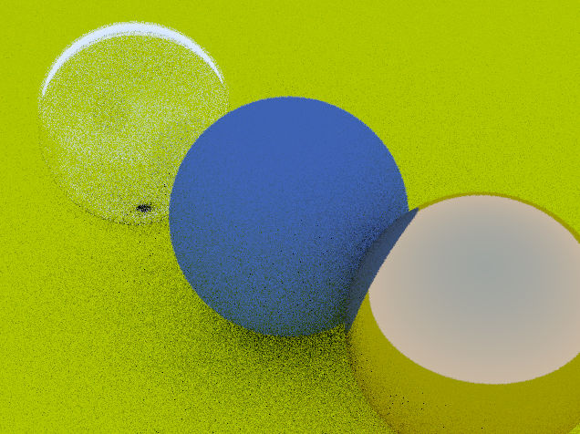

# Shady

Shady is a simple glsl writing environment created for rapid shader development.

## Functionality

|Feature|Key|
|-|-|
|Live reloading shaders| F5 |

## Compiling
### Dependencies
- [premake5](https://premake.github.io/)
- [GLFW](glfw.org)
- [glad](https://glad.dav1d.de/)

### Linux
[building]
- Install [GLFW](glfw.org) development binaries
- Run `premake5 gmake` in project directory
- Run `make all` in project directory

[cleanup]
- Run `make clean` in project directory

### Windows
[building]
- Run `premake5 vs2019` in project directory
- Open `*.sln` file with `Visual Studio (Community/Entiprise)`
<!-- - Weep -->

## Todo
- Time Controls
- Keyboard Input
- Load shaders by folder
- Shader management UI
- Add uniforms at runtime (through UI)
- Cross-Platform (Windows, Linux)
- Keyboard Input Uniforms
- ...
